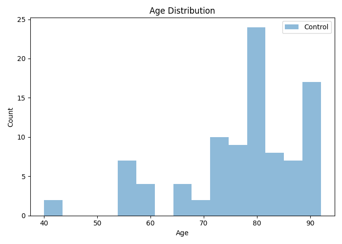
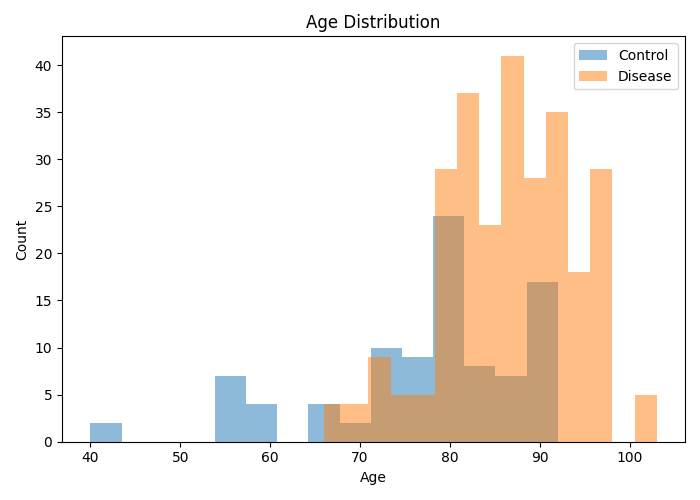
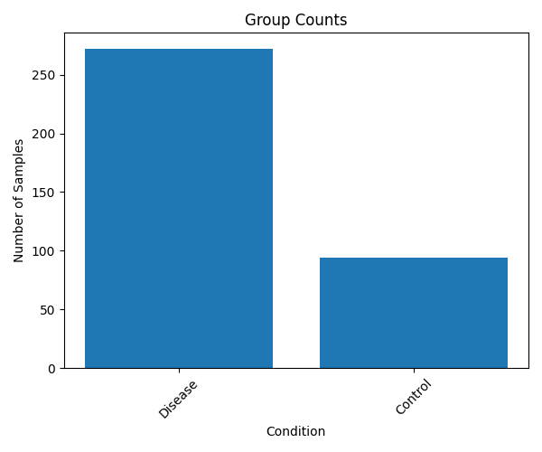
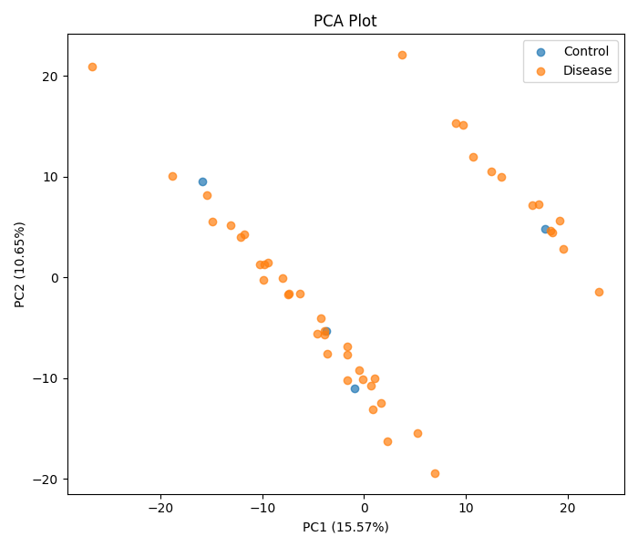
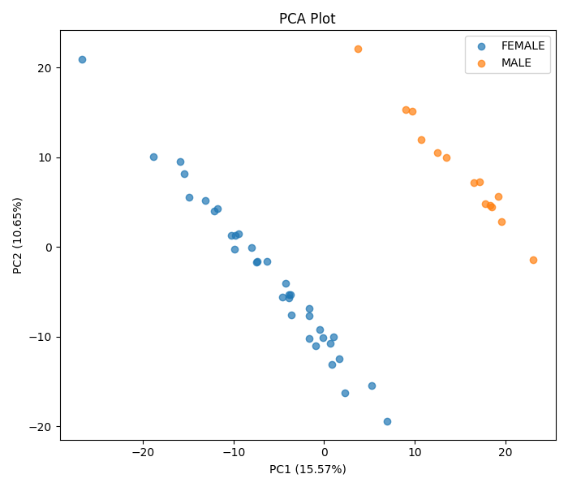
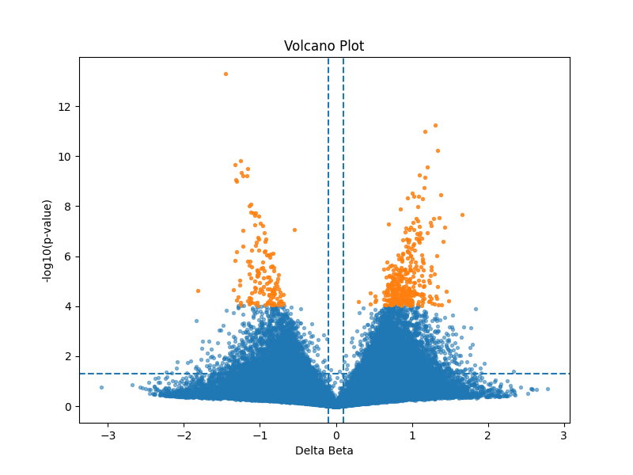

## Metprofiler
Metprofiler is a python pipeline built to automate the analysis of DNA methylation from this [dataset](https://www.ncbi.nlm.nih.gov/geo/query/acc.cgi?acc=GSE59685).
- Study setup: patient's DNA methylation profiles have been screening from different tissues. The progression of Alzheimers disease has been classified using the Braak scale.
- Disease-control split: All braak stages >= 3 were arbitrary classified as diseased by the authors, therefore the same threshold was applied

```
Disclaimer: 'This code was handwritten. LLMs were used for consultation on programming logic, documentation lookup, and API/function usage'

```

**Structure**

```
main.py <── DMA.py
^
├── samplesheet.csv <── samplesheet_workout.py
└── betas.csv

```


**Quick Start**

1. Install [`Conda`](https://conda.io/miniconda.html)

2. Install the required packages from the provided [environment.yml](./environment.yml) file with the following command:

```bash
conda env create -f environment.yml
```
or using [setup.py](./bin/setup.py)
``` bash
pip install -e .
```

3. cd into the bin directory

4. Start Methprofiler with the following command:

```bash
python3 ./bin/main.py
```


**Overarching logic**
1) [Prepare Samplesheet](./bin/samplesheet_workout.py)
- reads the xml file provided by the authors
- a regex within a for loop identifies tissue_source and sample_id attributes and combines them in a csv table

2) [Differential Methylation Analysis](./bin/DMA.py)
- Betas have a 3-rows header indicating the corresponding GSMs. For standardisation, the header is cut off and the beta values Samplesheet instead is used to subset the relevant barcodes.
- Due to the size of the table, the pipeline has the option to downsample the input beta table to make it more manageble during development. Default = 'Off'
- After loading the input files, the code asserts for missing Sample_Barcodes in the column names of the beta table

3) [Plotting](./bin/graphics.py)
- Samplesheet QC: distribution of probes based on covariates
- Principal Component Analysis for beta values


**Analysis of Blood Samples**
Metprofiler command to run the analysis on blood subset:
```bash
python ./bin/main.py assets/betas.csv assets/samplesheet.csv -o ./results/ --keep 'whole blood'
```
Age distribution tending towards elderly patients as expected, with a peak at 80 years old


Diseased samples are also as expected concentrated in older patients


There is significant more patients with the disease compared to controls


PCA shows that gender is an important confounding




The differential methylation results are represented as volcano plot highlighting the significant cpgs


The beta 


Conclusion: This analysis allows to shortlist significant CpGs that show differential methylation patterns between ALS and control patients after removing confounding variables
